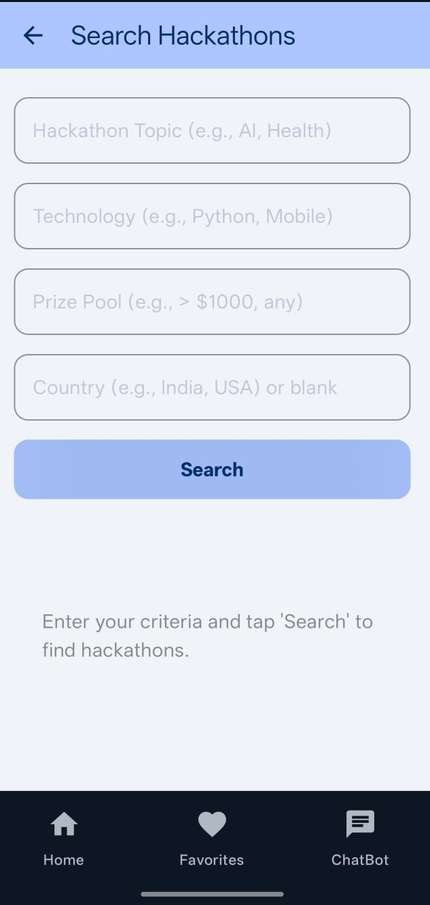
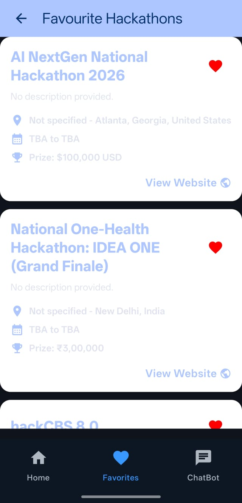
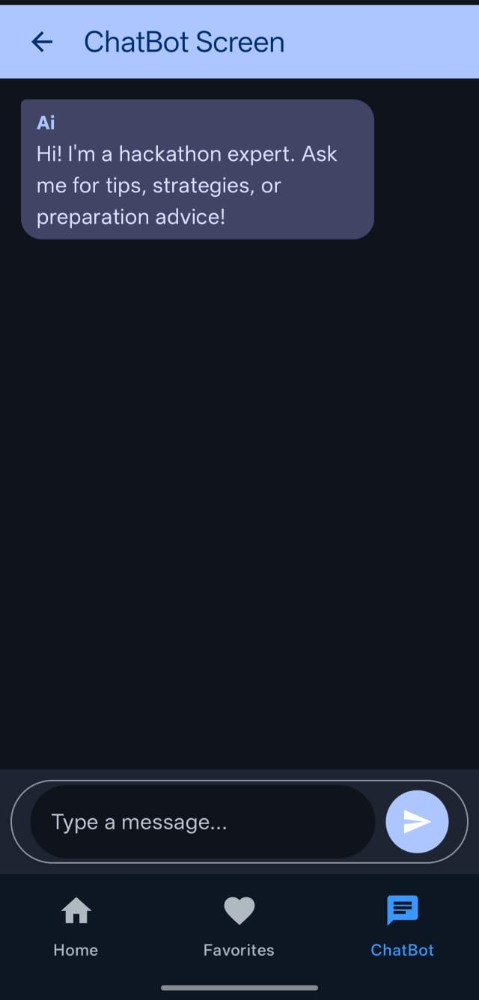

# 🚀 Hackathon Finder with AI Coach

<div align="center">


**Your AI-Powered Companion for Discovering and Preparing for Hackathons**

[Features](#-key-features) • [Screenshots](#-screenshots) • [Architecture](#-architecture) • [Tech Stack](#️-tech-stack) • [Setup](#️-setup--installation) • [Contributing](#-contributing)

</div>

---

## 📖 Overview

**Hackathon Finder** is a modern, native Android application designed to help developers **discover real-world hackathons** and **prepare effectively** with the help of an integrated **AI Hackathon Coach**, powered by **Google Gemini**.

Unlike traditional hackathon listing apps, Hackathon Finder uses **AI with Google Search grounding** to fetch real, up-to-date hackathon information from across the web. The app also features a conversational AI coach that provides hackathon-specific guidance — from idea brainstorming to team building to pitching strategies.

---

## ✨ Key Features

### 🔍 AI-Powered Hackathon Search
- **Real-time Discovery**: Uses Gemini AI with Google Search grounding to find live, upcoming hackathons
- **Smart Filters**: Search by topic (AI, Health, Fintech), technology (Python, React, Mobile), prize pool, and country
- **Rich Information**: Each result includes name, description, dates, prize pool, mode (Online/Offline), location, and direct links
- **Date-Aware**: Automatically filters out past events, showing only upcoming hackathons

### ❤️ Favorites Management
- **Save Hackathons**: Bookmark interesting hackathons for later
- **Cloud Sync**: Favorites are stored in Firebase Firestore for persistence
- **Easy Access**: Quick access to all saved hackathons from the dedicated Favorites tab

### 🤖 AI Chatbot Coach
- **Hackathon Expert**: Get tips, strategies, and advice specifically tailored for hackathon participants
- **Smart Guardrails**: The AI stays focused only on hackathon-related topics
- **Topics Covered**:
  - 💡 Idea generation and validation
  - 👥 Team building strategies
  - 🎯 Pitching and presentation tips
  - 🛠️ Technical preparation advice
  - ⏰ Time management during hackathons

### 🌐 In-App WebView
- **Seamless Experience**: View hackathon websites directly within the app
- **Loading Indicators**: Progress bar shows page loading status
- **JavaScript Support**: Full-featured web browsing experience

### 📱 Modern UI/UX
- **Jetpack Compose**: 100% built with declarative UI
- **Material Design 3**: Beautiful, modern design language with dynamic colors
- **Edge-to-Edge**: Immersive full-screen experience
- **Smooth Navigation**: Intuitive bottom navigation with animated transitions

---

## 📸 Screenshots

| Home | Search | Favorites | Chatbot |
|:---:|:---:|:---:|:---:|
|  |  |  |  |

---

## 🏗️ Architecture

The app follows the **MVVM (Model-View-ViewModel)** architecture pattern, ensuring clean separation of concerns and testability.

```
┌─────────────────────────────────────────────────────────────────┐
│                         UI LAYER                                 │
│  ┌─────────────┐ ┌─────────────┐ ┌─────────────┐ ┌─────────────┐│
│  │ HomeScreen  │ │SearchScreen │ │FavouriteScr │ │ChatBotScreen││
│  └──────┬──────┘ └──────┬──────┘ └──────┬──────┘ └──────┬──────┘│
│         │               │               │               │        │
│         └───────────────┴───────────────┴───────────────┘        │
│                              │                                    │
│         ┌────────────────────┴────────────────────┐              │
│         ▼                    ▼                    ▼              │
│  ┌─────────────┐     ┌─────────────┐     ┌─────────────┐         │
│  │ Hackathon   │     │ Favourite   │     │ ChatBot     │         │
│  │ ViewModel   │     │ ViewModel   │     │ ViewModel   │         │
│  └──────┬──────┘     └──────┬──────┘     └──────┬──────┘         │
│         │                   │                   │                │
└─────────┼───────────────────┼───────────────────┼────────────────┘
          │                   │                   │
          ▼                   ▼                   ▼
┌─────────────────────────────────────────────────────────────────┐
│                       DATA LAYER                                 │
│  ┌─────────────────────┐  ┌─────────────────────┐               │
│  │   Gemini API        │  │   Firebase          │               │
│  │   (Google Search    │  │   Firestore         │               │
│  │   Grounding)        │  │   (Favorites)       │               │
│  └─────────────────────┘  └─────────────────────┘               │
└─────────────────────────────────────────────────────────────────┘
```

### 📁 Project Structure

```
app/src/main/java/com/example/hackathon_finder/
├── MainActivity.kt              # Entry point, routes definition
├── bottomNavigation/
│   └── BottomNavigation.kt      # Bottom navigation bar component
├── data/
│   ├── BottomData.kt            # Navigation item data class
│   ├── ChatBotData.kt           # Chat message data model
│   └── HackathonData.kt         # Hackathon & UI state models
├── navcontroller/
│   └── NavigationScreen.kt      # Navigation graph setup
├── screens/
│   ├── HomeScreen.kt            # Landing page
│   ├── SearchHackathon.kt       # Search with filters & results
│   ├── FavouriteScreen.kt       # Saved hackathons list
│   ├── ChatBotScreen.kt         # AI chatbot interface
│   └── WebView Screen.kt        # In-app browser
├── ui/theme/
│   ├── Color.kt                 # Color definitions
│   ├── Theme.kt                 # Material 3 theme
│   └── Type.kt                  # Typography
└── viewModel/
    ├── HackathonViewModel.kt    # Search logic & Gemini integration
    ├── FavouriteViewModel.kt    # Firebase CRUD operations
    └── ChatBotViewModel.kt      # Chatbot conversation logic
```

---

## 🛠️ Tech Stack

| Category | Technology |
|----------|------------|
| **Language** | Kotlin 100% |
| **UI Framework** | Jetpack Compose with Material 3 |
| **Architecture** | MVVM (Model-View-ViewModel) |
| **Navigation** | Jetpack Navigation Compose |
| **AI Model** | Google Gemini 2.5 Flash (with Google Search grounding) |
| **Backend** | Firebase Firestore (for favorites storage) |
| **Networking** | OkHttp |
| **Async** | Kotlin Coroutines & StateFlow |
| **Build System** | Gradle with Kotlin DSL |
| **Min SDK** | 24 (Android 7.0) |
| **Target SDK** | 36 |

---

## ⚙️ Setup & Installation

### Prerequisites
- Android Studio Hedgehog (2023.1.1) or newer
- JDK 11 or higher
- Android device/emulator with API 24+

### 1. Clone the Repository

```bash
git clone https://github.com/your-username/hackathon-finder.git
cd hackathon-finder
```

### 2. Get Your Gemini API Key

1. Go to [Google AI Studio](https://aistudio.google.com/)
2. Sign in with your Google account
3. Navigate to **Get API Key** → **Create API Key**
4. Copy your API key

### 3. Configure the API Key

Add your API key to the `local.properties` file in the project root:

```properties
GEMINI_API_KEY=your_actual_api_key_here
```

> ⚠️ **Important**: Never commit `local.properties` to version control. It's already in `.gitignore`.

### 4. Firebase Setup (Optional - for Favorites)

The app uses Firebase Firestore for storing favorites. To enable this:

1. Create a project in [Firebase Console](https://console.firebase.google.com/)
2. Add an Android app with package name: `com.example.hackathon_finder`
3. Download `google-services.json` and place it in the `app/` directory
4. Enable Firestore in your Firebase project

### 5. Build & Run

1. Open the project in Android Studio
2. Sync Gradle files
3. Connect your Android device or start an emulator
4. Click **Run** ▶️

---

## 🧠 How the AI Works

### Hackathon Search (with Google Search Grounding)

The search feature uses **Gemini 2.5 Flash** with the **Google Search** tool enabled. This means:

1. Your search query is sent to Gemini with instructions to search the web
2. Gemini uses Google Search to find real, live hackathon listings
3. Results are parsed and returned with verified information
4. The AI is instructed to **never hallucinate** — it only returns data from actual search results

```kotlin
// System instruction enforces real data only
val systemInstruction = """
    You MUST use the Google Search tool to find live, real-world hackathons.
    CRITICAL: Do NOT make up, hallucinate, or invent hackathons.
    Every field (name, url, prize) MUST be from the Google Search results.
"""
```

### AI Chatbot Coach

The chatbot uses strict system instructions to stay focused on hackathon topics:

```kotlin
val systemInstruction = """
    You are a helpful assistant for hackathon participants.
    Your ONLY job is to provide tips, strategies, and advice related to hackathons.
    If the user asks about ANYTHING else, respond with:
    "I'm sorry, I am only able to respond to questions about hackathons."
"""
```

This ensures the AI provides relevant, hackathon-focused advice without going off-topic.

---

## 🔧 Configuration

### API Models Used

| Feature | Model | Endpoint |
|---------|-------|----------|
| Hackathon Search | `gemini-2.5-flash` | `v1beta/models/gemini-2.5-flash:generateContent` |
| Chatbot | `gemini-2.5-flash-preview-09-2025` | `v1beta/models/gemini-2.5-flash-preview-09-2025:generateContent` |

### Customization

You can customize the app behavior by modifying:

- **Colors**: `app/src/main/res/values/colors.xml`
- **Theme**: `ui/theme/Theme.kt`
- **AI Behavior**: Modify system instructions in the respective ViewModels

---

## 🤝 Contributing

Contributions are welcome! Here are some ways you can help:

### Ideas for Improvement
- 📋 Chat history persistence
- 🎤 Voice input for chatbot
- 🔔 Push notifications for saved hackathon reminders
- 📅 Calendar integration
- 🌍 Localization support
- 🧪 Unit and UI tests

### How to Contribute

1. **Fork** the repository
2. **Create** a feature branch
   ```bash
   git checkout -b feature/AmazingFeature
   ```
3. **Commit** your changes
   ```bash
   git commit -m "Add some AmazingFeature"
   ```
4. **Push** to the branch
   ```bash
   git push origin feature/AmazingFeature
   ```
5. **Open** a Pull Request

### Code Style
- Follow Kotlin coding conventions
- Use meaningful variable and function names
- Add comments for complex logic
- Test your changes before submitting

---

## 📄 License

This project is open source and available under the MIT License.

---

## 🙏 Acknowledgments

- [Google Gemini](https://ai.google.dev/) for the powerful AI capabilities
- [Firebase](https://firebase.google.com/) for real-time database
- [Jetpack Compose](https://developer.android.com/jetpack/compose) for modern UI development
- The hackathon community for inspiration

---

<div align="center">

⭐ **If you find this project useful, give it a star on GitHub!** ⭐

Made with ❤️ for the hackathon community

</div>
